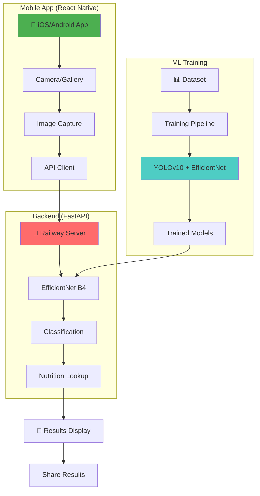
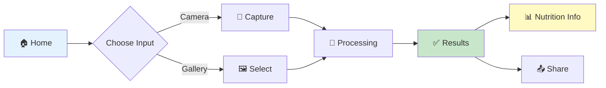
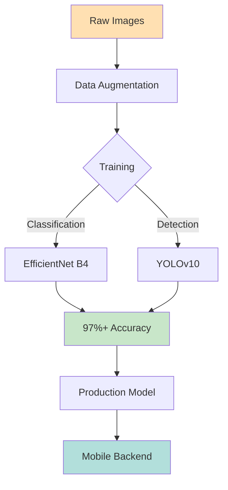
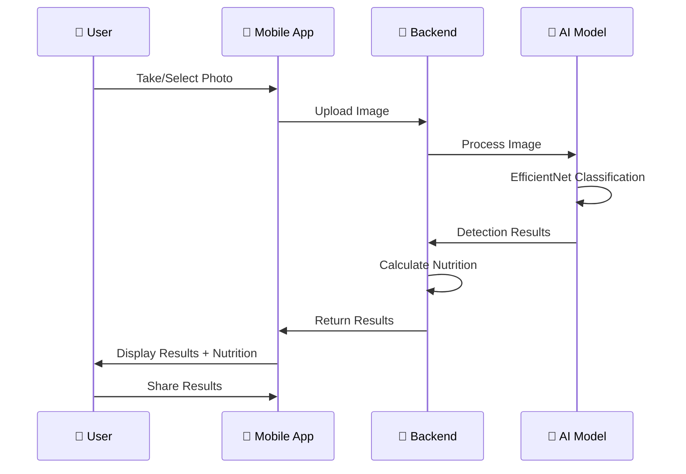
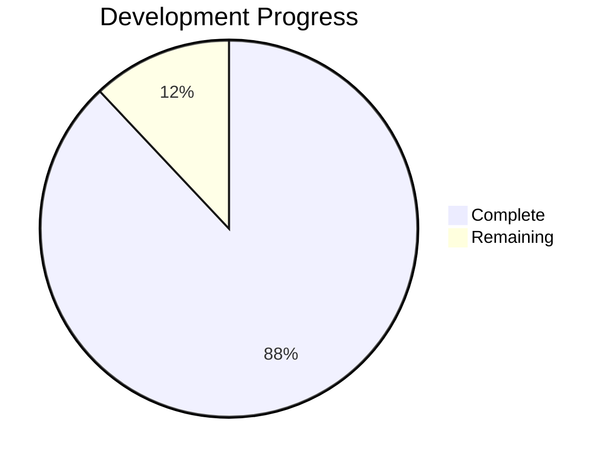

# 🍜 Vietnamese Food Detection

AI-powered mobile app for detecting Vietnamese dishes with nutritional information.

## 📊 Project Architecture



## 🌿 Branch Structure

```
vn-food-detection/
│
├── 📱 mobile-app          # React Native + Backend
│   ├── VNFoodDetection/   # Mobile app
│   └── server/            # FastAPI + Model
│
└── 🧠 training            # ML Training Pipeline
    ├── src/               # Training scripts
    ├── data_master/       # Dataset (30 classes)
    └── models/            # Trained models
```

## 🚀 Quick Start

### Mobile App Development
```bash
git clone -b mobile-app https://github.com/silent9669/vn-food-detection.git
cd vn-food-detection/mobile-app
```

### ML Training
```bash
git clone -b training https://github.com/silent9669/vn-food-detection.git
cd vn-food-detection
./menu.sh
```

## 📱 Mobile App Features



**Tech Stack:**
- React Native + TypeScript
- Platform-specific UI (iOS/Android)
- 69+ tests (92% pass rate)
- Railway backend deployment

## 🧠 ML Pipeline



**Capabilities:**
- 30 Vietnamese food classes
- 17,581 training images
- Hybrid detection system
- Nutrition calculation

## 📊 System Flow



## 🎯 Supported Dishes (30 Classes)

| Category | Examples |
|----------|----------|
| **Noodles** | Phở, Bún bò Huế, Bún chả |
| **Rice** | Cơm tấm, Cơm gà |
| **Bread** | Bánh mì |
| **Cakes** | Bánh xèo, Bánh cuốn, Bánh bèo |
| **Rolls** | Gỏi cuốn, Nem chua |
| **Others** | 20+ more dishes |

## 📈 Project Status



**Completed (36/41 tasks):**
- ✅ Mobile app development
- ✅ Backend API with ML model
- ✅ Platform-specific UI
- ✅ Railway deployment ready
- ✅ Testing & documentation

**Remaining (5 tasks):**
- 🔄 Railway deployment
- 🔄 Android release build
- 🔄 iOS release build
- 🔄 App store listings
- 🔄 Final testing

## 🔗 Links

- **Mobile App Branch:** [mobile-app](https://github.com/silent9669/vn-food-detection/tree/mobile-app)
- **Training Branch:** [training](https://github.com/silent9669/vn-food-detection/tree/training)
- **Documentation:** See branch-specific docs

## 📞 Contact

**Email:** phuc.dangcs2007@hcmut.edu.vn

---

<div align="center">
  <b>🍜 Detect • Analyze • Track</b>
  <br>
  <i>Vietnamese Food Detection with AI</i>
</div>
